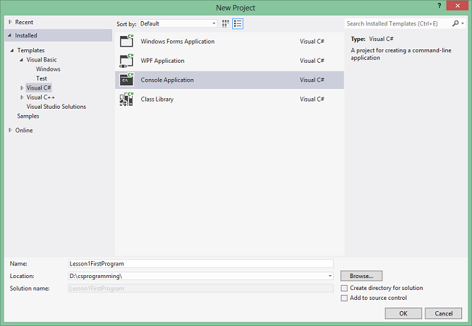
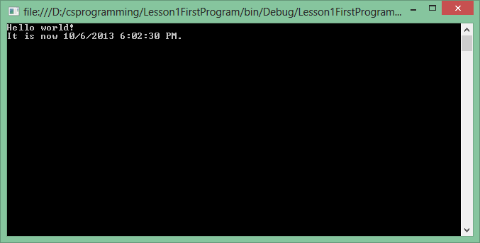
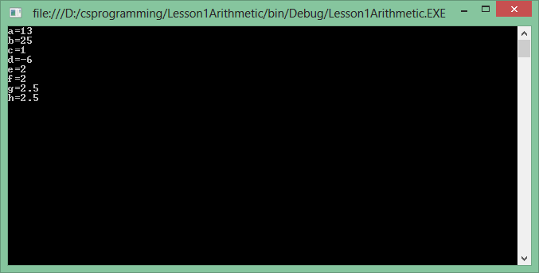
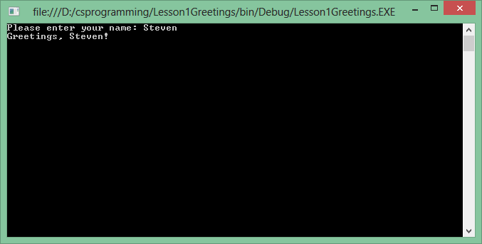
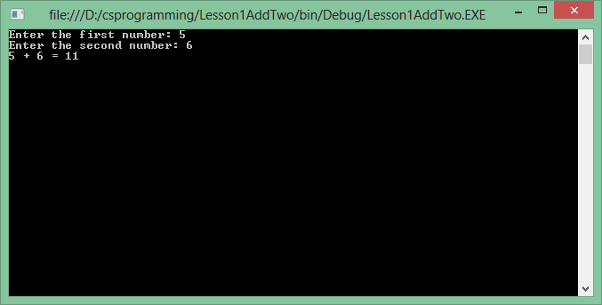

# Lesson 1: The Basics

This lesson will introduce to you the basic of programming via the C# language. The concepts in this lesson should be applicable to most programming languages on the market, not just specific to C#.

## 1.1 Your first program

### 1.1.1 Setup your development environment
To make programming with C# easier, you should have Microsoft .NET Framework and Visual Studio installed. This lesson will use [Microsoft .NET Framework 4.5](http://www.microsoft.com/en-us/download/details.aspx?id=30653) and [Visual Studio Express 2012 for Windows Desktop](http://www.microsoft.com/visualstudio/eng/downloads#d-2012-express); both are freely available for download but you'll need a Live Account to use Visual Studio Express 2012 beyond 30 days.


### 1.1.2 Creating a new project
Time to launch Visual Studio for your first program! To create a new C# project, go to **Menu File → New Project**.

* When the New Project dialog shows up, choose **Templates → Visual C#** on the left and **Console Application** on the right.
* Enter **Lesson1FirstProgram** for the name
* Select an appropriate location to save this project.
* For simplicity, **uncheck "Create directory for solution"** for now.




### 1.1.3 Coding time
From the **Solution Explorer**, open **Program.cs** and replace its content with the following:

```c#
using System;

namespace Lesson1FirstProgram
{
    class Program
    {
        static void Main(string[] args)
        {
            Console.WriteLine("Hello world!");
            Console.WriteLine("It is now {0}.", DateTime.Now);
            Console.ReadKey(true);
        }
    }
}
```

To run this program, go to **Menu Debug → Start Debugging**. You should see something similar to this:



### 1.1.4 Code explanation
For now, you can just focus on the 3 lines of code that start with `Console`. The code surrounding them will be explained to you in later lessons.

As you might have guessed, the first two lines displays "Hello world!" and the current date time to the console windows. Notice the `{0}` on the second line actually displays the value provided by `DateTime.Now`. You can have `WriteLine` output more than one value by using `{0}`, `{1}`, etc. 

The third line of code waits for the user to press any key. Without this line, you won't be able too see the console window. The program simply writes text to the console and quits immediately.

Notice the semi-colons at the end of these three lines. Because white-spaces aren't meaningful in C#, the semi-colons let C# know that it is the end of a code line.

*Even though white-spaces aren't meaningful, you should still indent the code that belongs to a particular code-block (in this case, these 3 lines belong to the `Main` code-block). As your program gets larger, indentation is necessary for code readability.*


## 1.2 Data Types and Variables

### 1.2.1 Data Types
We can loosely describe a computer program as a list of computer instructions which are executed in order. Sometimes, it is useful to have the program "remember things" at an earlier point of the program so that you can use them later. In most programming languages, these things are called "variables." Each variable can hold a value of a particular type. In C#, there are different types of values, such as an integer or an alphabet character. This table lists the common C# value types (see the [C# Reference](http://msdn.microsoft.com/en-us/library/vstudio/bfft1t3c.aspx) for a complete list of C# value types):

| Data Type | C# Notation | C# Literal Form | Description |
| --------- | ----------- | --------------- | ----------- |
| Integer   | `int`       | `5`, `3`        | A variable of this data type can represent integer numbers from -2,147,483,648 to 2,147,483,647 |
| Long integer | `long` | `5L`, `3L` | Integer numbers from –9,223,372,036,854,775,808 to 9,223,372,036,854,775,807 |
| Floating-point number | `float` | `5F`, `3.0F` | Floating-point variables can represent a 7-digit precision floating-point number which can represent numbers approximately from -3.4e38 to 3.4e38 |
| Double precision floating-point | `double` | `5.0D`, `3.0`, `4D` | This data type represents a 15-digit precision floating point number which can represent numbers approximately from ±5.0e−324 to ±1.7e308 |
| Single character | `char` | `'A'`, `'1'` | This data type represents a single character. C# characters are <a href="http://en.wikipedia.org/wiki/Unicode">Unicode</a> characters.|
| String | `string` | `"A"`, `"ABC"`, `"123"` | A string lets you represent one or more characters. Note that a variable of string type is stored in a different location in memory, which you will learn about in another lesson. |

### 1.2.2 Variables
Now that you know some of the basic C# data types, let's make use of them! Create a new **Console Application** project called **Lesson1Variables**. Open **Program.cs** and enter the following lines of code inside of `Main`:


```c#
static void Main(string[] args)
{
    string name;
    name = "Bob";
    int number = 18;

    Console.WriteLine("My name is {0} and my favorite number is {1}", name, number);
    Console.ReadKey(true);
}
```

Your console window should display "My name is Bob and my favorite number is 18". 

### 1.2.3 Code explanation
Before you can use a variable, you first must declare it. Every variable in C# must have a type, and can only hold values of that type. The C# syntax to declare a variable starts with the data type, followed by a space, then followed by the variable name (and the semi-colon if at the end of the line). Variable names must start with an alphabet letter, follow by any alpha-numeric characters or the underscore character. Variable names cannot contain any spaces, and cannot be the same as any of the [C# keywords](http://msdn.microsoft.com/en-us/library/x53a06bb.aspx).

```c#
int houseNumber;
```


The equal sign operator can be used to give a variable some values.

```c#
houseNumber = 10;
```


You can use a short-hand syntax to declare a variable and give it a value on the same line.

```c#
int houseNumber = 10;
```


## 1.3 Arithmetic

### 1.3.1 Introduction to C# arithmetic
Like most languages, C# supports a wide range of math operations on numbers. This chapter will introduce the basic integer and floating-point arithmetic operations. This table list the five common operations performed on numeric variables:

| Operation | Operator | Example  |
| --------- | -------- | -------- |
| Addition  | `+`      | `int x = 1 + 2;` |
| Subtraction | `-` | `int x = 5 - 1;` |
| Multiplication | `*` | `int x = 4 * 5;` |
| Division | `/` | `float x = 10.0F / 4;` |
| Modulus (remainder of division) | `%` | `int x = 7 % 3;` |

Note that just like math, multiplication, division, and modulus has precedence over addition and subtraction and you can use parentheses to indicate which operations should be performed first.

One more thing that you need to keep in mind when doing math operation is the variable types. An integer variable cannot hold a floating point value, which means if you try to give an integer the result of `10 / 4`, the result will be `2` and the numbers after the decimal point will be stripped out.

### 1.3.2 Example code

Create a new project called **Lesson1Arithmetic**. Enter the following lines of code into the `Main` code-block:

```c#
int a = 3 + 2 * 5;
int b = (3 + 2) * 5;
int c = 10 % 3;
int d = 2 - 8;
int e = 10 / 4;
float f = 10 / 4;
float g = 10.0F / 4;
float h = 10.0F / 4.0F;

Console.WriteLine("a={0}", a);
Console.WriteLine("b={0}", b);
Console.WriteLine("c={0}", c);
Console.WriteLine("d={0}", d);
Console.WriteLine("e={0}", e);
Console.WriteLine("f={0}", f);
Console.WriteLine("g={0}", g);
Console.WriteLine("h={0}", h);

Console.ReadKey(true);
```


Your output should look like this:



I want to point your attention to the value of `f`. Even though it has a type of `float`, the output is still `2`. The reason behind that is when the code is executed, the right side of the equal sign is actually performing an integer operation, yielding the value of `2`. Because `f` is a `float` variable, the value `2` is then converted to approximately `2.0F` then assigned to `f`. However, `WriteLine` strips out trailing zeros, hence you only see `2` in the output.

## 1.4 Console Input
Now that you know all about C# variables and data types, let's make our programs more useful by letting users enter values that we can work with.

### 1.4.1 Greetings
We'll get started with a simple program, which asks the user for his or her name, and then display a greeting.

Create a new project named **Lesson1Greetings** and enter this into the `Main` code-block:

```c#
string name;

Console.Write("Please enter your name: ");
name = Console.ReadLine();

Console.WriteLine("Greetings, {0}!", name);

Console.ReadKey(true);
```

Running your program should look something like this:



There are two new commands in this program you haven't seen before:

1. `Console.Write`: this command is similar to `Console.WriteLine` except it doesn't start a new line after displaying the text.
2. `Console.ReadLine`: this command waits for user to enter a `string` in the console. When the user hits Enter (or Return), that string is then given to the variable to the left of the equal sign (`name` in this case). 

### 1.4.2 AddTwo
Let's make something a little more complicated. We'll have the user enter two integers, then add them together and display the result.

Create a new project named **Lesson1AddTwo**:

```c#
int firstNumber;
int secondNumber;
int sum;
string userInput;

Console.Write("Enter the first number: ");
userInput = Console.ReadLine();
firstNumber = int.Parse(userInput);

Console.Write("Enter the second number: ");
userInput = Console.ReadLine();
secondNumber = int.Parse(userInput);

sum = firstNumber + secondNumber;

Console.WriteLine("{0} + {1} = {2}", firstNumber, secondNumber, sum);
Console.ReadKey(true);
```

The program should look similar to this:



In this program, I want to turn your attention to three things:

1. The variable `userInput` has type `string`. As mentioned before, `Console.ReadLine` always returns a string, we need to have a string variable to hold the value that user typed. In C#, the string `"5"` is different from the integer `5`. Because of that, the number 5 that I entered is treated as value `"5"`
2. `int.Parse` is used to convert a string to an integer.
3. The variable `userInput` is re-used for the second input. Because the program immediately converts the first user input to integer and stores it in the appropriate `int` variable, there is no need to have a different `string` variable for the second input. 


## 1.5 Summary
In this lesson, you learned how to write to the console window using `Console.Write` and `Console.WriteLine`. You also learned about different data types in C#, how to declare variables and perform numeric arithmetic on them.

## 1.6 Exercises

### 1.6.1 Christmas tree
Create a project named **Lesson1ChristmasTree** which prints a Christmas tree to the console window:

```
    *
   ***
  *****
 *******
*********
    *
```

### 1.6.2 Average
Create a project named **Lesson1Average** which asks the user for three numbers and calculates the average:

```
Enter the first number: 6
Enter the second number: 3
Enter the third number: 2

Average of 6, 3, and 2 is 3.66666666666667
```

